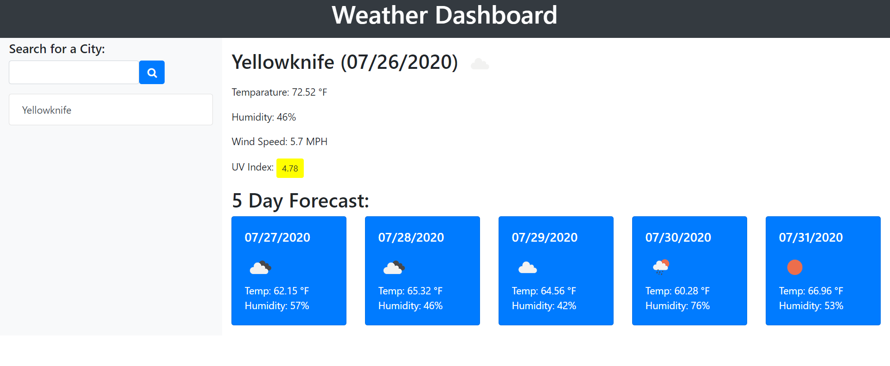
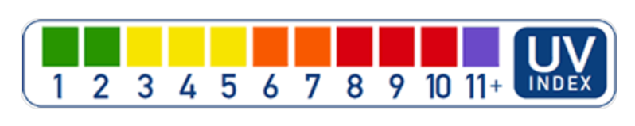
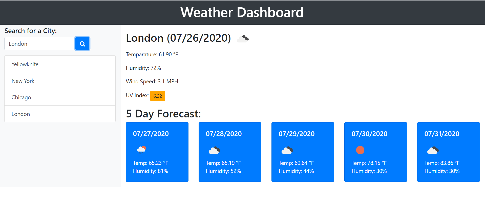

# 06-Weather-Dashboard

This is a weather Dashboard, which provided Today's weather along
with 5 day forecast by using third-party APIs which allow developers to access their data 
and functionality by making requests with specific parameters to a URL. 

When I search for a city, then, Today's weather for that city along with 5 day forecast
is displayed on the screen and this city is added to the search History.

In Today's Forecast, the following information is displayed:
  - Temerature in Fahrenheit
  - Humidity in %
  - Wind Speed in MPH
  - UV Index (this information comes using a different API than the above 3
  
 UV index is color coded Based on the below information

The UV Index represents a color that indicates whether the conditions are favorable, moderate, or severe.

For the city that user is seraching the weather, a 5-day forecast is also displyed.
The Forecast for each day displays the date, an icon representation of weather conditions, the temperature, and the humidity.
User can click on a city in the search history to get current and future
conditions of that city.

When you open this dashboard, last serached city forecast is displayed.
